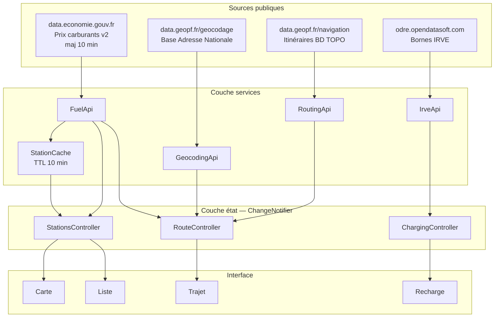
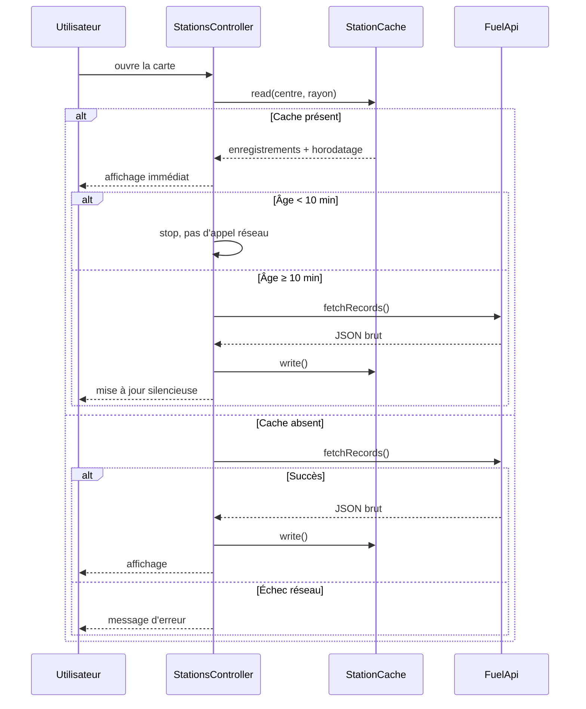
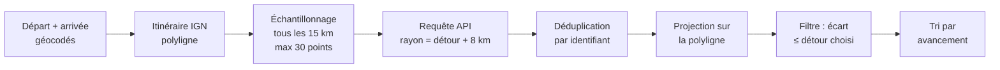
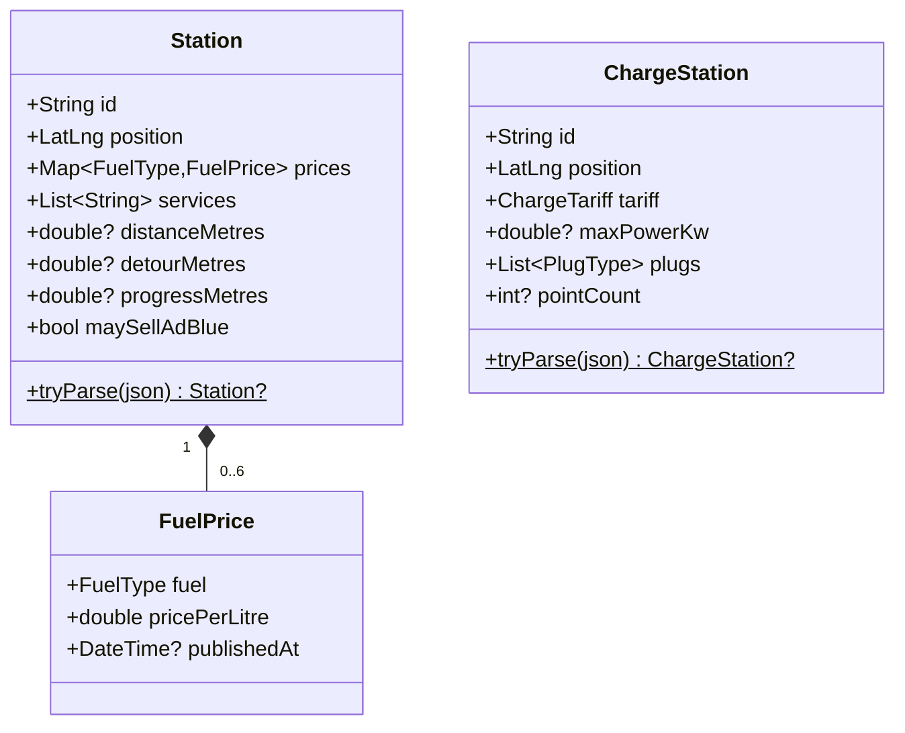
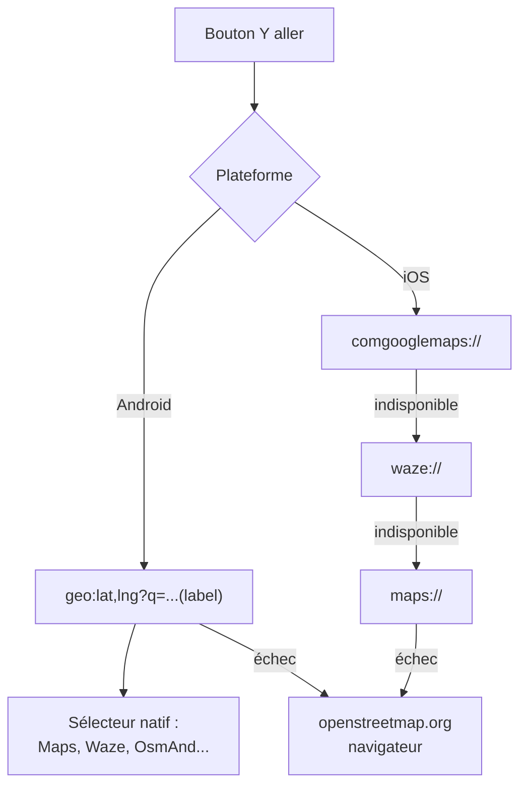
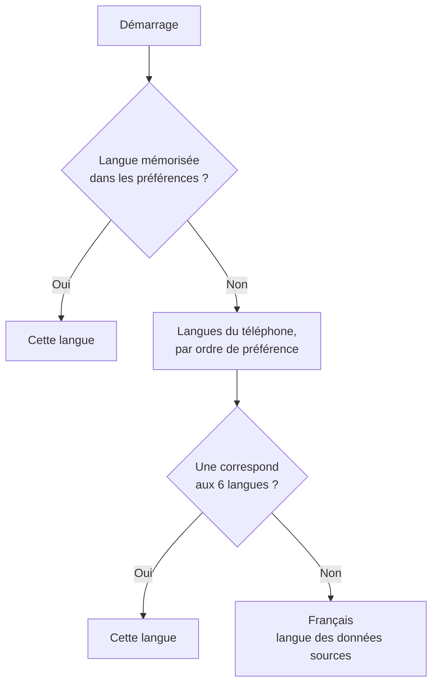

# Carbu — Documentation de développement

**Usage interne.** Ce document décrit l'architecture, les sources de données et
les décisions techniques du projet. Il n'est pas destiné aux utilisateurs.

| | |
|---|---|
| Version du document | 1.5 |
| Version applicative | 1.4.0+14 |
| Framework | Flutter (Dart ≥ 3.3) |
| Cibles | Android (actuelle), iOS (planifiée) |
| Volume | ~11 800 lignes de Dart, 52 fichiers |
| Traductions | 214 clés × 6 langues |
| Tests | 5 fichiers, ~105 cas |
| Langues | fr (modèle), en, de, nl, it, es |

---

## 1. Vue d'ensemble

Carbu agrège quatre sources publiques françaises pour répondre à une question :
*où faire le plein au meilleur prix, maintenant, autour de moi ou sur ma route.*

Aucune source ne demande de clé d'API, aucune donnée utilisateur n'est
transmise à un serveur tiers. La position GPS reste sur l'appareil et ne sert
qu'à construire les requêtes géographiques.



**Point structurant :** la carte et la liste partagent un même
`StationsController`. Changer de carburant ou de rayon dans l'une se répercute
dans l'autre sans appel réseau. Le trajet et la recharge ont leur propre
contrôleur, car leur cycle de vie est indépendant.

---

## 2. Sources de données

| Source | Point d'accès | Limite | Licence |
|---|---|---|---|
| Prix carburants | `data.economie.gouv.fr` Explore v2.1 | 100 résultats/requête | Licence Ouverte 2.0 |
| Géocodage | `data.geopf.fr/geocodage/search` | 50 req/s/IP | Licence Ouverte |
| Itinéraire | `data.geopf.fr/navigation/itineraire` | 5 req/s/IP | Licence Ouverte |
| Bornes IRVE | `odre.opendatasoft.com` (`bornes-irve`) | 100 résultats/requête | Licence Ouverte |
| Tuiles | `data.geopf.fr/wmts` (WMTS, matrice PM) | Sans quota annoncé | Licence Ouverte |
| Garages et services | `overpass-api.de/api/interpreter` | Instance bénévole, usage modéré | ODbL |

### 2.1 Historique des ruptures de schéma

Le flux carburants a changé plusieurs fois. Le parsing doit rester tolérant.

| Date | Changement |
|---|---|
| 23/11/2023 | Champs `carburant_maj` : texte → datetime |
| 25/01/2024 | Modification des données visibles, API inchangée |
| 01/03/2024 | Ajout des types de rupture et dates de début |
| 09/04/2024 | Changement d'URL du jeu de données |
| 22/05/2026 | Moissonnage réglé à 15 min (flux toujours à 10 min) |

L'API Adresse `api-adresse.data.gouv.fr` a été **décommissionnée en janvier
2026** au profit de la Géoplateforme IGN. Le code utilise directement la
nouvelle URL.

### 2.2 Quirks gérés par le parsing

`Station.tryParse` et `ChargeStation.tryParse` ne lèvent jamais d'exception :
un enregistrement illisible est ignoré, jamais propagé.

| Anomalie | Traitement |
|---|---|
| Coordonnées en cent-millièmes de degré | Division par 10⁵ si hors bornes |
| Prix en millièmes d'euro (`1749`) | Division par 1000 si valeur > 10 |
| Prix aberrant (< 0,10 ou > 10 €) | Rejeté |
| `geom` en `{lat,lon}`, `{coordinates}` ou chaîne brute | Trois branches de lecture |
| IRVE : coordonnées `[lon, lat]` inversées | Détection par amplitude (> 90 = longitude) |
| IRVE : puissance en watts | Division par 1000 si valeur > 1000 |
| Enseigne absente | Repli sur la commune |

---

## 3. Flux de chargement et cache



**Décisions :**

- **TTL de 10 minutes**, calé sur la cadence du flux officiel. Au-delà, la
  donnée est périmée par construction.
- **Clé de cache arrondie au centième de degré** (~1 km) : deux recherches
  voisines partagent la même entrée.
- **Le cache est stocké en JSON brut**, pas en objets `Station`. Le parsing est
  rejoué à la lecture, ce qui évite d'avoir à versionner un format sérialisé.
- **Purge à 40 entrées**, les plus anciennes d'abord.
- **En cas d'échec réseau avec cache présent**, on garde l'affichage et on
  signale l'ancienneté. Un écran vide serait une régression pour l'utilisateur.

---

## 4. Recherche le long d'un trajet

L'algorithme évite deux écueils : interroger l'API des milliers de fois, et
manquer des stations entre deux points de recherche.



**Paramètres et justifications :**

| Paramètre | Valeur | Pourquoi |
|---|---|---|
| Espacement | 15 km | Compromis entre couverture et nombre d'appels |
| Points max | 30 | Plafonne le coût réseau, ~450 km sans perte |
| Marge de requête | détour + 8 km | Évite les trous entre deux échantillons |
| Délai entre appels | 200 ms | Respecte les quotas des deux API |

**Limite assumée :** le détour est mesuré **à vol d'oiseau** par rapport au
tracé, pas en temps de conduite réel. Calculer 40 itinéraires secondaires
dépasserait le quota IGN de 5 req/s et rendrait la recherche interminable.

**Robustesse :** un échantillon en échec n'annule pas la recherche. Les
résultats sont publiés au fil de l'eau via `notifyListeners()`, l'utilisateur
voit la liste se remplir.

---

## 5. Modèle de données



### 5.1 Rangs de prix

Les couleurs des pastilles reposent sur les **tertiles de la distribution
réellement chargée**, pas sur des seuils fixes. Un seuil absolu serait faux :
le prix médian varie de plusieurs centimes entre régions et dans le temps.

Le rang est calculé sur l'ensemble *avant* filtre de prix maximum, pour que les
couleurs restent stables quand l'utilisateur resserre le curseur.

### 5.2 Tarification des bornes

Le champ `gratuit` est déclaratif et souvent absent. Trois états sont donc
distingués — `free`, `paid`, `unknown` — plutôt que de présumer « payant » en
l'absence d'information. Présumer serait faux aussi souvent que l'inverse.

Le fichier IRVE décrit **un point de charge par ligne** ; le regroupement par
station se fait dans `IrveApi._groupByStation`, en conservant la puissance
maximale et l'union des types de prise.

---

## 6. Lancement du guidage



Le schéma `geo:` d'Android affiche le sélecteur d'applications système :
l'utilisateur garde son GPS habituel, et aucune clé Google n'est nécessaire.

**Piège :** depuis Android 11, sans le bloc `<queries>` dans le manifeste,
`canLaunchUrl` renvoie systématiquement `false` et le bouton reste sans effet.

---

## 7. Arborescence

```
lib/
├── main.dart                    Point d'entrée
├── theme.dart                   Jetons de design
├── models/
│   ├── fuel_type.dart           Six carburants et clés API
│   ├── station.dart             Point de vente + parsing tolérant
│   └── charge_station.dart      Borne de recharge (schéma IRVE)
├── services/
│   ├── fuel_api.dart            Requête géographique carburants
│   ├── irve_api.dart            Bornes, regroupées par station
│   ├── geocoding_api.dart       Autocomplétion BAN
│   ├── routing_api.dart         Itinéraire IGN
│   ├── station_cache.dart       Cache local, TTL 10 min
│   ├── location_service.dart    GPS et permissions
│   └── navigation_launcher.dart Ouverture du GPS installé
├── state/
│   ├── stations_controller.dart Carte + liste
│   ├── route_controller.dart    Trajet
│   └── charging_controller.dart Bornes
├── screens/
│   ├── home_shell.dart          Navigation 4 onglets
│   ├── map_screen.dart
│   ├── list_screen.dart
│   ├── route_screen.dart
│   ├── charging_screen.dart
│   └── about_screen.dart        Présentation intégrée
├── widgets/
│   ├── price_marker.dart        Pastille de prix
│   ├── station_sheet.dart       Fiche point de vente
│   ├── station_tile.dart        Ligne de liste
│   ├── charge_widgets.dart      Marqueur + fiche borne
│   ├── fuel_filter_bar.dart
│   └── filter_sheet.dart        Rayon + prix maximum
└── utils/
    ├── geo.dart                 Haversine, projection, échantillonnage
    └── dates.dart               Formatage et fraîcheur
```

---

## 8. Direction visuelle

Référence : le **totem lumineux de station-service**. Plaque sombre
(`#12161C`), chiffres à chasse fixe, liseré coloré selon le rang. Les couleurs
d'action reprennent le bleu de la signalisation autoroutière (`#1B4C8C`).

Cette grammaire est reprise à l'identique par les marqueurs de bornes
électriques : même plaque, même typographie, la puissance remplaçant le prix.
Un utilisateur qui a compris une vue a compris l'autre.

Aucune police externe n'est embarquée : `monospace` est résolu par la
plateforme, ce qui garde le projet installable par un simple `flutter run`.

---

## 8 bis. Internationalisation

### Chaîne de génération

Les traductions ne s'écrivent pas à la main dans les six fichiers ARB :
`lib/l10n/generer_traductions.py` contient un dictionnaire unique et émet les
six fichiers. Le script **échoue si une traduction manque**, ce qui rend
impossible l'oubli d'une langue lors de l'ajout d'une clé.

```
generer_traductions.py  →  app_fr.arb (modèle) + 5 traductions
                        →  flutter gen-l10n (automatique au pub get)
                        →  AppLocalizations (généré, non versionné)
```

`app_fr.arb` est le modèle : il porte seul les descriptions et les
`placeholders`. Les cinq autres ne contiennent que les traductions.

### Résolution de la langue



Le repli sur le français est délibéré : les données affichées (adresses,
services, horaires) sont en français de toute façon.

### Décisions

- **Les contrôleurs ne produisent plus de texte.** Ils émettent des
  `AppMessage` typés (`lib/l10n/app_messages.dart`), résolus par l'interface au
  moment de l'affichage. Sans cela, un message d'erreur resterait figé dans la
  langue active au moment de l'erreur.
- **Les codes européens ne sont pas traduits.** La norme EN 16942 impose B7,
  E5, E10, E85 sur toutes les pompes de l'UE : afficher « E10 » est plus utile
  à un étranger qu'un nom traduit. Seuls « Diesel » et « GPL » le sont, ces
  sigles étant moins reconnus.
- **La détection des ruptures se fait sur les noms français de la source.**
  `kFuelSourceNames` dans `fuel_type.dart` : le flux publie « Gazole », pas le
  libellé traduit. Confondre les deux casserait la détection dès le premier
  changement de langue.
- **Les nombres passent par `NumberFormat`.** Un prix s'écrit 1,679 en français
  et 1.679 en anglais. Le `toStringAsFixed(3)` d'origine a été retiré partout.
- **`initializeDateFormatting()` est appelé au démarrage.** Sans lui, tout
  format de date hors anglais lève une exception.
- **Les noms de langue s'affichent dans leur propre langue.** Un utilisateur
  perdu dans une interface qu'il ne lit pas doit reconnaître « Deutsch ».

### Reste à traduire

`lib/screens/about_screen.dart` est volontairement resté en français : c'est de
la documentation utilisateur, traduite en fin de projet avec la plaquette PDF.
Environ 30 chaînes.

---

## 8 ter. Audit du 0.5 — défauts trouvés et corrigés

| Défaut | Gravité | Correction |
|---|---|---|
| `Station.displayName` renvoyait `'Point de vente'` en dur | **Fuite de français** en interface traduite | `displayName` devient nullable ; l'interface fournit le libellé traduit |
| `ChargeStation.displayName` renvoyait `'Station de recharge'` | Idem | Idem |
| `ChargeTariff` portait encore des libellés français | Code mort trompeur | Champ supprimé, `tariffLabel()` seule source |

Les trois venaient de la même cause : **un modèle qui produit du texte destiné
à l'affichage**. La règle retenue est désormais explicite — les modèles
renvoient des données ou `null`, jamais un libellé de repli.

### Améliorations fonctionnelles du 0.5

| Fonction | Justification |
|---|---|
| **Favoris** | La plupart des conducteurs font le plein aux deux ou trois mêmes endroits. Persistés par identifiant seulement, jamais les prix. |
| **Écart par plein** | 3 centimes au litre semblent négligeables ; 1,50 € par plein ne l'est pas. Même information, seule la seconde permet de décider d'un détour. Hypothèse (50 L) affichée, jamais masquée. |
| **Désencombrement carte** | Sous le zoom 11,5 les pastilles se chevauchent. Bascule sur des points colorés qui conservent le rang de prix. |
| **États vides distincts** | « Aucune station ne vend ce carburant ici » et « vos filtres sont trop stricts » appellent des actions différentes, donc des messages différents. |
| **Bouton Réessayer** | Une erreur réseau sans action possible laisse l'utilisateur bloqué. |

---

## 8 quater. Fond de carte — migration 0.6

`tile.openstreetmap.org` est remplacé par le service WMTS de la Géoplateforme
IGN. Tout passe par `lib/services/map_tiles.dart` : changer de fournisseur ne
touche plus qu'un fichier.

```
https://data.geopf.fr/wmts
  ?SERVICE=WMTS&VERSION=1.0.0&REQUEST=GetTile
  &LAYER=GEOGRAPHICALGRIDSYSTEMS.PLANIGNV2
  &STYLE=normal&TILEMATRIXSET=PM&FORMAT=image/png
  &TILEMATRIX={z}&TILEROW={y}&TILECOL={x}
```

**Pourquoi la matrice PM.** C'est la projection Web Mercator standard : les
indices de tuiles correspondent directement au schéma `{z}/{x}/{y}` de
`flutter_map`, sans inversion de l'axe vertical. Le service TMS de l'IGN
(`/tms/1.0.0/…`) existe aussi mais expose une convention d'axe différente —
piège classique, la carte s'affiche alors à l'envers verticalement.

**Deux couches.** Plan IGN v2 par défaut, photographies aériennes en bascule.
La vue aérienne n'est pas un gadget : elle aide à repérer l'entrée d'une station
ou à distinguer deux pompes voisines dans une zone commerciale.

**Zoom natif 19, zoom max 20.** Au-delà du zoom natif, `flutter_map` agrandit la
dernière tuile plutôt que d'en demander une inexistante, ce qui évite les carrés
gris.

**Limite géographique assumée.** Les tuiles IGN ne couvrent que la France et les
DOM. Sans conséquence : le flux des prix ne couvre que la France non plus.

**Conséquence sur le mode sombre.** L'IGN ne propose pas de style sombre en
raster. Un mode sombre resterait donc possible pour l'interface, mais avec un
fond de carte clair — combinaison peu satisfaisante de nuit. À traiter le jour
où les tuiles vectorielles IGN (`PLAN.IGN` personnalisable) seront intégrées,
ce qui permettrait un style sombre sur mesure.

---

## 8 quinquies. Garages et services — 0.7

Source : **OpenStreetMap via Overpass**, trois catégories retenues —
`shop=car_repair`, `shop=tyres`, `amenity=car_wash`.

### Pourquoi OSM plutôt que SIRENE

L'API `recherche-entreprises.api.gouv.fr` expose un endpoint `near_point`
filtrable par code NAF (45.20A / 45.20B), exhaustif par construction. Il a
pourtant été écarté : c'est un **registre administratif, pas un annuaire de
services**. Aucun horaire, aucun téléphone, et un siège social déclaré n'est
pas un atelier où l'on peut se présenter — sociétés de dépannage sans local,
adresses de domiciliation. Pour un conducteur en panne, l'exhaustivité de
SIRENE apporte du bruit plutôt que de la couverture.

À noter pour l'avenir : les champs latitude/longitude ont été retirés du jeu de
données brut de l'Annuaire en mai 2026, au profit d'un jeu séparé. Signe que
cette chaîne bouge.

### Une requête pour tout un trajet

Contrairement au carburant, **le mode trajet ne nécessite qu'un seul appel**.
Overpass accepte une liste de coordonnées dans le filtre `around`, ce qui
définit un couloir le long de la polyligne :

```
nwr["shop"="car_repair"](around:5000,lat1,lon1,lat2,lon2,…);
```

La polyligne d'itinéraire compte des milliers de points — trop pour une URL.
Elle est donc rééchantillonnée à un point tous les 3 km, plafonnée à 120, ce
qui décrit le couloir sans faire exploser la taille de la requête.

### Décisions

- **Les horaires ne sont pas interprétés.** La syntaxe `opening_hours` d'OSM
  gère jours fériés, semaines paires, fermetures saisonnières. Une
  interprétation approximative afficherait « ouvert » à tort — pire que
  d'afficher la chaîne brute que l'utilisateur lit lui-même.
- **Pas de catégorie « dépanneur ».** C'est pourtant le besoin réel en panne,
  mais OSM le distingue mal (`service:vehicle:towing` est rare). Promettre un
  dépanneur qu'on ne sait pas identifier serait pire que ne rien promettre.
- **Les trois catégories sont toujours chargées ensemble**, le filtrage est
  local : une requête Overpass coûte moins au serveur que trois.
- **Anti-rebond à 900 ms**, contre 600 ms pour le carburant. L'instance
  publique est financée par des bénévoles.
- **Chargement paresseux** : rien n'est demandé tant que l'onglet n'est pas
  ouvert.
- **Marqueurs volontairement discrets** — pastilles rondes et non plaques de
  totem. Ces points sont du contexte, pas le sujet de l'application.

### Classification par enseigne (0.8)

Trois familles : **chaînes** (Norauto, Feu Vert, Euromaster, Speedy…),
**réseaux de marque** (Renault, Peugeot, Volkswagen…), et **sans enseigne
identifiée**. Le catalogue est dans `lib/models/garage_brand.dart`.

**Classification en trois passes**, par fiabilité décroissante :

1. Étiquettes `brand` puis `operator`, en correspondance exacte après
   normalisation (accents, espaces et ponctuation retirés : « FEU-VERT » et
   « feu vert » se rejoignent).
2. Recherche par inclusion dans le `name` — beaucoup de contributeurs ne
   remplissent que celui-ci. « Garage Renault Dupont » est ainsi rattrapé. Les
   clés de moins de 4 ou 5 caractères sont exclues de cette passe : « ds » ou
   « mg » produiraient des faux positifs par inclusion.
3. Une étiquette `brand` non reconnue est conservée telle quelle plutôt que
   déclarée indépendante — l'absence du catalogue n'est pas l'absence
   d'enseigne.

**Les chaînes priment sur les marques** dans la passe par nom : « Renault
Minute » est un service Renault, mais « Norauto » dans un nom désigne toujours
la chaîne.

**La liste d'enseignes proposée est construite depuis les résultats chargés**,
pas depuis le catalogue. Proposer « Euromaster » là où il n'y en a aucun ferait
perdre du temps. Chaque enseigne affiche son nombre d'occurrences.

**Sélection d'enseignes vide = toutes**, jamais aucune. Et masquer une
affiliation nettoie les enseignes sélectionnées qui en dépendaient, pour éviter
un filtre contradictoire silencieux.

### Enseignes de stations-service (0.9)

Même mécanique que pour les garages, appliquée au carburant :
`lib/models/station_brand.dart`. Deux familles — **pétroliers**
(TotalEnergies, Avia, Esso, BP, Shell, Eni…) et **grande distribution**
(Carrefour, E.Leclerc, Intermarché, Système U, Auchan…) — plus « sans
enseigne ».

**Regroupement des déclinaisons.** « Total Access », « Total Relais », « Elan »
et « Argedis » remontent tous à TotalEnergies ; « Netto » à Intermarché ;
« Super U », « Hyper U » et « U Express » à Système U. Un conducteur cherche
une marque, pas un format de point de vente.

**La lacune structurelle du flux.** Contrairement à OSM, le jeu de données
officiel n'a pas de champ d'enseigne normalisé : l'information apparaît selon
les exports dans `brand`, `enseigne` ou `nom`, et manque dans une large part
des cas. Trois conséquences assumées :

1. La catégorie « sans enseigne » **affiche son effectif** — l'utilisateur
   mesure l'ampleur de la lacune au lieu de la subir.
2. Une réserve explicite prévient que filtrer sur une marque peut masquer des
   stations qui en font partie mais dont l'enseigne n'est pas publiée.
3. Les lignes de liste marquent « Sans enseigne » plutôt que de laisser un vide
   ambigu.

**`bp` et `eni` sont exclus de la recherche par inclusion** : deux et trois
lettres apparaissent dans quantité de mots sans rapport. Seule la
correspondance exacte les identifie.

**Le filtre est partagé entre carte et liste** via `StationBrandFilter`. Deux
jeux de filtres divergents feraient croire à l'utilisateur qu'il perd des
stations en changeant d'onglet.

### La limite honnête de « indépendant »

Cette catégorie signifie *aucune enseigne renseignée dans OpenStreetMap*, pas
*garage réellement indépendant*. Un concessionnaire mal saisi s'y retrouve. La
réserve est affichée dans le panneau de filtres plutôt que cachée dans cette
documentation : l'utilisateur qui filtre sur « indépendants » pour obtenir un
devis moins cher doit savoir ce qu'il obtient vraiment.

### Regroupement en bulles (1.1)

Le seuil de zoom de la v0.5, qui masquait les prix en dessous du zoom 11,5, est
remplacé par un **regroupement en bulles** portant le nombre de points. Toucher
une bulle zoome de deux crans et l'éclate.

**Le regroupement se fait par proximité à l'écran, pas en mètres.** C'est le
bon critère : deux stations distantes d'un kilomètre se chevauchent à l'échelle
d'une région et se distinguent parfaitement à celle d'un quartier. Le seuil
suit donc le zoom, sans constante arbitraire.

**Algorithme.** Découpage du plan en cellules de 90 pixels au zoom courant
(légèrement plus large qu'une pastille de prix), via une projection Web
Mercator normalisée. Compromis assumé : moins précis qu'un regroupement par
distance réelle, mais linéaire, stable d'une image à l'autre et sans dépendance
externe — `flutter_map_marker_cluster` aurait imposé une contrainte de version
supplémentaire.

**Appliqué aux trois cartes**, avec une teinte de liseré par type de contenu :
bleu pour les prix, vert pour les bornes, violet pour les garages.

`zoomToExpand` avance de deux crans plutôt que d'un : cela quadruple la surface
disponible, ce qui sépare la plupart des groupes en un seul geste sans
désorienter par un saut trop brutal.

### Tests (1.1)

Quatre fichiers, environ 90 cas, exécutés par `flutter test`.

| Fichier | Couverture |
|---|---|
| `station_parsing_test.dart` | Coordonnées en cent-millièmes, prix en millièmes, virgule décimale, prix aberrants, ruptures, services, classification d'enseigne |
| `charge_station_parsing_test.dart` | Ordre `[lon, lat]`, chaîne brute, watts vs kilowatts, trois états tarifaires, normalisation des opérateurs |
| `service_poi_parsing_test.dart` | Catégories OSM, centroïdes de chemins, adresses partielles, classification des enseignes de garages |
| `clustering_test.dart` | Haversine, projection sur polyligne, échantillonnage, regroupement selon le zoom |

**Principe directeur des tests :** chaque anomalie documentée en section 2.2 a
son cas de test. Un test par quirk connu, plutôt qu'une couverture de lignes
sans intention.

Chaque fichier vérifie aussi qu'un enregistrement dégradé **ne lève jamais
d'exception** et n'empêche pas de lire les autres — c'est la garantie
structurelle sur laquelle repose toute la tolérance du parsing.

### Risque assumé

L'instance publique Overpass n'offre aucune garantie de disponibilité et peut
limiter le débit. En cas d'indisponibilité, l'onglet affiche une erreur avec un
bouton Réessayer ; le reste de l'application n'est pas affecté. Si l'usage
grossit, il faudra soit héberger une instance, soit basculer sur un extrait OSM
préparé côté serveur.

---

## 8 sexies. Audit du 1.2 — défauts trouvés et corrigés

Revue complète : cohérence des clés de traduction, imports, code mort, logique
de rafraîchissement, ergonomie.

| # | Défaut | Gravité | Correction |
|---|---|---|---|
| 1 | La carte n'écoutait que `StationsController`, pas `FavoritesController` | **Fonctionnel** | L'étoile d'un marqueur ne se mettait à jour qu'au rechargement suivant. Fusion des deux sources par `Listenable.merge`. |
| 2 | `servicesAlongRoute` ne filtrait pas par détour | **Fonctionnel** | La requête interroge un couloir élargi de 8 km ; des garages hors détour apparaissaient. Filtre déplacé dans l'accesseur, et rechargement seulement si le détour s'élargit. |
| 3 | Abonnement aux favoris posé après `load()` | Latent | Fonctionnait par chance, la première notification survenant après un `await`. Ordre inversé pour ne pas dépendre du hasard d'ordonnancement. |
| 4 | Le bouton « À propos » recouvrait la barre des carburants | **Ergonomie** | Deux éléments placés au même endroit en haut à droite. |
| 5 | Quatre boutons flottants empilés au-dessus de la barre de navigation | **Ergonomie** | Encombrement de la zone la plus disputée de l'écran. |
| 6 | Six clés de traduction mortes | Propreté | `zoomForPrices` notamment, rendue obsolète par le regroupement en bulles. Supprimées des six langues. |
| 7 | Fiche station du mode Trajet sans favori ni écart par plein | Cohérence | La même fiche n'offrait pas les mêmes capacités selon l'onglet. |

### Réorganisation des commandes de la carte (défauts 4 et 5)

Trois zones étaient en concurrence : le haut à droite (barre des carburants
*et* bouton « À propos »), et le bas à droite (quatre boutons flottants *et*
barre de navigation à cinq onglets).

Solution retenue : un **bandeau vertical sur le bord droit médian**, seule zone
restée libre et atteignable au pouce, regroupant fond de carte, actualisation
et « À propos ». Le bas à droite ne conserve que les deux actions principales,
filtres et localisation. Les cibles tactiles font 44 points.

### Ce que l'audit n'a pas trouvé

Aucune clé de traduction manquante, aucune classe morte, aucune dépendance
circulaire, aucun import réellement inutilisé. Les 90 cas de test passent en
revue le parsing, mais **rien n'a encore été compilé** : les erreurs de typage
résiduelles ne seront détectées que par `flutter analyze`.

---

## 8 septies. Six fonctions du 1.3

### Comparaison à la moyenne départementale

L'agrégation est faite **par l'API**, pas dans l'application :
`select=avg(gazole_prix)` renvoie un nombre, là où récupérer les stations du
département se heurterait au plafond de 100 résultats.

Le filtre porte sur `startswith(cp, "69")` et non sur un champ département :
`cp` est toujours présent dans le flux, ce qui n'est pas garanti des autres
champs administratifs. Cache de six heures — une moyenne départementale bouge
lentement.

**Pourquoi cette fonction compte :** les tiers de couleur donnent un classement
*local*. Un prix « parmi les moins chers » d'un secteur cher reste un prix
cher ; la comparaison à la moyenne donne le repère absolu qui manquait.

### Carnet de pleins

Méthode **plein-à-plein** : le volume d'un plein couvre la distance parcourue
*depuis* le précédent. Le premier plein est donc exclu du calcul — on ignore
quelle distance il a couverte. L'hypothèse du plein complet est rappelée dans
l'interface.

Entièrement local. C'est la seule fonction de l'application qui produise des
données personnelles, et elle ne quitte jamais l'appareil.

**Placement :** accessible depuis le bandeau latéral de la carte, pas comme
sixième onglet. Six destinations dans une `NavigationBar` deviennent illisibles
sur un téléphone étroit, et le carnet se consulte après le plein, pas pendant
la recherche.

### Arrêt conseillé sur trajet

Parmi les stations encore atteignables avec l'autonomie déclarée, la moins
chère. **Marge de sécurité de 10 %** : conseiller un arrêt à l'extrême limite
de l'autonomie n'est pas un conseil acceptable.

Les stations hors de portée restent affichées, estompées, plutôt que masquées :
si l'estimation de l'utilisateur est pessimiste, l'information lui reste utile.

### Points poids lourd

`amenity=fuel` + `hgv=yes` dans OpenStreetMap, placés dans l'onglet Services et
**volontairement séparés des stations du flux officiel**, qui ne publie aucune
information de gabarit. Les rapprocher par proximité produirait des faux
positifs — et un 40 tonnes engagé dans une station inadaptée ne peut pas faire
demi-tour. Le même raisonnement que pour les cartes carburant, avec la même
conclusion : ne pas mélanger deux sources dont l'une ne sait pas.

### Filtre 24h/24 et partage

Le filtre 24h/24 est placé **au-dessus** des filtres d'enseigne : l'ouverture
permanente est une contrainte, pas une préférence.

Le partage produit un lien de coordonnées standard, ouvrable par n'importe
quelle application de cartographie du destinataire — pas un lien propriétaire.

---

## 8 octies. Audit du 1.4 — défauts trouvés et corrigés

| # | Défaut | Gravité | Correction |
|---|---|---|---|
| 1 | Le message d'erreur du formulaire de plein affichait « Enregistrer » | **Fonctionnel** | Une saisie incomplète affichait le libellé du bouton au lieu d'expliquer le problème. Clé dédiée. |
| 2 | Les filtres d'enseigne s'appliquaient aux points poids lourd | **Cohérence** | Une station poids lourd est une station-service, pas un garage : décocher « Chaînes » la faisait disparaître, et son enseigne polluait la liste des réseaux d'entretien. |
| 3 | La réserve poids lourd n'apparaissait qu'après avoir touché un point | Ergonomie | Déplacée dans le panneau de filtres, là où la catégorie s'active. |
| 4 | Texte d'aide du compteur redondant | Ergonomie | « Compteur (km) : Compteur (km) ». Clé dédiée. |
| 5 | Le carnet n'avait qu'un point d'entrée, sur la carte | Ergonomie | Introuvable pour qui reste sur la liste. Second accès depuis « À propos ». |
| 6 | `initState` sans effet dans le formulaire | Propreté | Supprimé. |

### Améliorations du même passage

**Montant calculé en direct** dans le formulaire de plein. Un ticket de pompe
affiche le montant, pas le prix au litre : voir le total se former permet de
vérifier qu'on n'a pas inversé deux chiffres.

**Filtres repliables dans la liste.** Rayon, favoris, enseignes et prix maximum
occupaient tout le premier écran ; il fallait défiler longuement avant de voir
une station. Repliés par défaut, avec un compteur de filtres actifs sur
l'en-tête — un filtre oublié ne reste jamais invisible.

**Puces de filtre accessibles.** Les puces étaient de simples `GestureDetector` :
un lecteur d'écran annonçait un texte, sans dire qu'il était actionnable ni s'il
était actif. Toutes portent désormais `Semantics(button, selected)`.

### Vérifications passées sans écart

- Aucune clé de traduction manquante ni morte, dans les six langues
- Aucun import manquant, aucune dépendance circulaire
- Structures équilibrées dans les fichiers modifiés
- Tous les `Timer` annulés, tous les clients HTTP fermés. Les trois contrôleurs
  sans `dispose` explicite — favoris, langue, carnet — ne détiennent aucune
  ressource et héritent de `ChangeNotifier`.
- Le texte de partage contient de vrais sauts de ligne et non des barres
  obliques inversées littérales — piège classique d'un ARB généré depuis Python.

---

## 8 octies. Audit du 1.4

Revue portant sur les six fonctions du 1.3 : clés de traduction, arité des
paramètres, cycles de vie, ergonomie.

| # | Défaut | Gravité | Correction |
|---|---|---|---|
| 1 | `AveragesApi` instancié dans chaque fiche station | **Ressources** | Un client HTTP ouvert par fiche, et cache mémoire vidé entre deux consultations. Instance partagée `AveragesApi.shared`. |
| 2 | Le filtre de prix du mode Trajet annonçait toujours « aucune station masquée » | **Fonctionnel** | `hiddenCount` était câblé en dur à zéro. Compteur réel ajouté au contrôleur. |
| 3 | Points poids lourd chargés à chaque requête Overpass | **Sobriété** | Quatre clauses systématiques pour un besoin de niche, sur une instance bénévole. Chargés uniquement quand la catégorie est activée. |
| 4 | Formulaire de trajet occupant 160 lignes de widgets après la recherche | **Ergonomie** | Les résultats étaient repoussés hors écran. Repli automatique après un calcul réussi, avec résumé et bouton « Modifier ». |

### Détail du repli du formulaire (défaut 4)

Le repli n'intervient **qu'en cas de succès** : si l'itinéraire échoue, la
saisie reste ouverte pour être corrigée. C'est le point qui distingue un repli
utile d'un repli agaçant.

### Vérifications automatisées mises en place

L'audit a produit deux contrôles reproductibles, à relancer après chaque
évolution :

1. **Clés de traduction** — croisement des clés définies dans l'ARB et de
   celles réellement appelées dans le code, dans les deux sens.
2. **Arité des paramètres** — comparaison du nombre de `placeholders` déclarés
   et du nombre d'arguments passés, en tenant compte des virgules finales
   autorisées par Dart. Ce contrôle attrape une classe d'erreurs que
   `flutter analyze` signale tard et de façon peu lisible.

Un troisième contrôle vérifie que le générateur Python reste la source unique :
aucune clé ne doit exister dans l'ARB sans figurer dans le script.

### Faux positifs identifiés

Deux heuristiques ont produit du bruit, documentées ici pour ne pas relancer
l'enquête : la détection d'imports inutilisés ne comprend pas les symboles de
paquets externes, et la détection de `setState` après `await` ne distingue pas
un rappel synchrone déclaré dans un `build`.

---

## 9. Dette technique et limites connues

| Sujet | Gravité | Détail |
|---|---|---|
| Plafond 100 résultats | Structurel | En zone dense, un rayon de 15 km peut être moins complet qu'un rayon de 5 km. |
| Détour à vol d'oiseau | Assumé | Approximation nécessaire pour tenir les quotas. |
| Enseignes manquantes | Source | Le flux officiel ne les publie pas systématiquement. Le filtre par enseigne l'affiche explicitement plutôt que de le masquer. |
| Qualité IRVE inégale | Source | Fichier consolidé de dizaines de producteurs. |
| Traductions non relues | À traiter | Interface traduite par mes soins ; une relecture native reste souhaitable avant publication. |

### Cartes carburant professionnelles : écarté

Demande étudiée en v1.0, **non implémentée**. Le flux officiel publie un
service « Automate CB » qui atteste la présence d'un automate, jamais les
cartes acceptées : ni Total GR, ni DKV, ni UTA, ni AS24, ni Shell Card.

Deux voies existaient, toutes deux rejetées :

| Voie | Motif du rejet |
|---|---|
| Étiquettes `payment:*` d'OpenStreetMap | Couverture très faible sur ce tag, et appariement par proximité avec la station du flux officiel générateur d'erreurs. On afficherait une donnée rare et parfois fausse. |
| Cartes de stations partenaires des réseaux | Sites commerciaux, sans API ouverte ni droit de réutilisation. |

**Le coût d'erreur est le facteur décisif** : un chauffeur qui fait un détour
pour une carte finalement non acceptée est plus mal servi que s'il n'avait rien
lu. Repli retenu : le signalement des stations autoroutières, qui acceptent
presque toujours les cartes professionnelles, reste une heuristique honnête.

### Produits sans source ouverte

| Produit | Situation |
|---|---|
| AdBlue | Pas un carburant au sens du flux. Seul indice : service « vente d'additifs ». Affiché sans prix. |
| GNR | Aucun recensement national, aucun prix par station. |
| Fioul domestique | Livré en citerne. Seules existent des moyennes hebdomadaires nationales (DGEC). |
| Cartes carburant pro | Le flux atteste la présence d'un automate CB, jamais les cartes acceptées. |

Une couverture réelle de ces produits impliquerait une **saisie
communautaire** : backend, comptes, modération. Changement de nature du projet,
à décider avant de coder.

---

## 10. Avant publication sur le Play Store

1. **Politique de confidentialité** obligatoire dès lors que la localisation
   est demandée, même sans transmission.
2. **Écran « À propos »** mentionnant la Licence Ouverte 2.0 — fait, l'attribution
   IGN est affichée sur la carte.
3. **Déclaration du formulaire de données** : localisation approximative et
   précise, non collectée, non partagée.
4. **Icône et écran de lancement** — actuellement ceux générés par défaut.
5. **Tests de parsing** avant toute évolution du schéma amont.

---

## 11. Journal des versions

| Version | Contenu |
|---|---|
| 0.1 | Carte, marqueurs de prix, fiche station, lancement GPS |
| 0.2 | Liste triée, rayon 5/10/15 km, prix maximum, cache local, mode trajet |
| 0.3 | Bornes de recharge IRVE, renommage des carburants, indication AdBlue |
| 0.4 | Multilingue fr/en/de/nl/it/es, détection système, sélecteur de langue |
| 0.5 | Audit et correctifs, favoris, écart par plein, désencombrement carte, états vides |
| 0.6 | Fonds de carte IGN Géoplateforme, bascule plan / vue aérienne |
| 0.7 | Garages, pneumaticiens et lavage via OpenStreetMap, en zone et sur trajet |
| 0.8 | Filtre par enseigne des garages : chaînes, réseaux de marque, sans enseigne |
| 0.9 | Filtre par enseigne des stations : pétroliers, grande distribution |
| 1.0 | Filtre par réseau de recharge (opérateur), mention du paiement à l'acte |
| 1.1 | Tests unitaires du parsing (~90 cas), regroupement des marqueurs en bulles |
| 1.2 | Audit complet : 2 bugs fonctionnels, 2 défauts d'ergonomie, 3 corrections de cohérence |
| 1.3 | Moyenne départementale, filtre 24h/24, partage, carnet de pleins, arrêt conseillé, points poids lourd |
| 1.4 | Audit : client HTTP partagé, compteur de filtre corrigé, Overpass allégé, formulaire de trajet repliable |
| 1.4 | Audit : 6 défauts corrigés, filtres repliables, accessibilité des puces, montant calculé |
